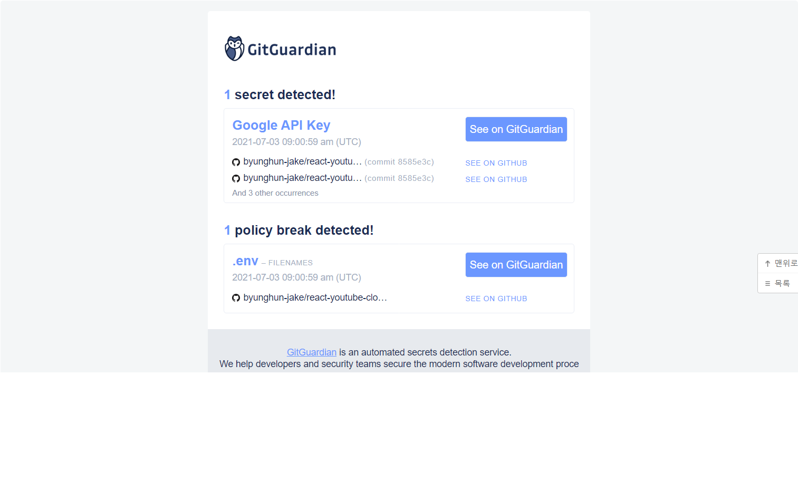
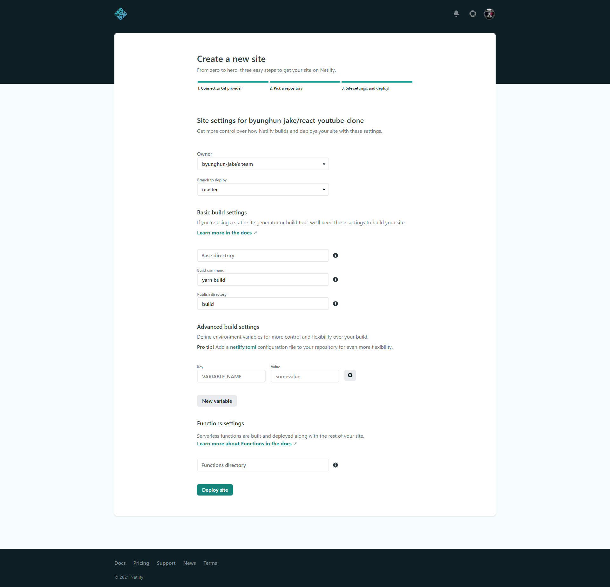

# Youtube - React (with. dream-coding)


## 작업 순서


### 1. react app 생성

```bash
$ npx create-react-app youtube-react
```


### 2. API

#### Youtube API

이전 Vue 실습 때, 신청했던 youtube api를 그대로 사용


#### Postman

> API가 정상적으로 동작하는지 확인

base_url: `https://www.googleapis.com/youtube/v3/search`

query

- 공통
  - part: `snippet`
  - type: `video`
  - key: `비밀이야!`
  - maxResults: `20`
- 검색
  - q: `bts`
- 인기 영상
  - chart: `mostPopular`


#### 설계

```js
// api.js
const youtubeAPI = axios.create({
    baseURL: "https://www.googleapis.com/youtube/v3/",
    params: {
        key: API_KEY,
        part: "snippet",
        type: "video",
    },
})
```


| url            | 목적           |
| -------------- | -------------- |
| search/        | 영상 검색      |
| videos/        | 인기 영상 목록 |
| videos?id={id} | 특정 영상 정보 |


### 3. 컴포넌트 설계

```
- home
	- TheHeader
	- PopularVideos (인기 비디오 & 검색 비디오)
		- videoItem
	- SearchedVideos
		- videoItem
	- videoDetail
		- videoPlayer
		- relatedVideos
		
```


### 4. 작업!

- API
  - [x] getMostPopularVideos
  - [x] getSearchResults
  - [x] getVideo


- Component
  - [x] TheHeader
  - [x] Videos
  - [x] VideoItem
  - [x] VideoDetail


- Function
  - [x] Search


#### 컴포넌트의 생명주기 중 어디에서 AJAX 호출을 할 수 있나요?

AJAX 호출을 통한 데이터는 생명주기 메서드 중 [`componentDidMount`](https://ko.reactjs.org/docs/react-component.html#mounting) 안에 추가되어야 합니다. 이는 데이터를 받아 올 때 `setState`를 통하여 컴포넌트를 업데이트하기 위함입니다.

[참고링크](https://ko.reactjs.org/docs/faq-ajax.html#where-in-the-component-lifecycle-should-i-make-an-ajax-call)


#### dangerouslySetInnerHTML

lodash의 unescape 메서드를 사용했을 때와 같은 결과가 나올 수 있도록 했음


#### Videos에서 VideoDetail로 이동하는 조건은?

- 선택한 video가 없음 => Videos
- 선택한 video가 있음 => VideoDetail


#### dotEnv

Youtube API Key는 외부에 노출되면 안되니, dotEnv로 관리합니다.

[참고 블로그](https://www.daleseo.com/js-dotenv/)

리액트에서는 dotenv의 key값에 prefix를 붙여주어야 한다는 것을 알 수 있었다.

```
REACT_APP_API_KEY=hi
API_KEY=ki
```

```js
require("dotenv").config()
console.log(process.env.REACT_APP_API_KEY)	// hi
console.log(process.env.API_KEY)			// undefined
```


또한, dotenv의 값을 변경했다면 서버를 재시작해주어야 한다는 점!


## 문제


### 1. 원격저장소에 올라간 내 .env 파일

youtubeAPI key를 코드에 넣을 수는 없어서, `.env` 파일에 담아 관리하였는데... 이런... `.env` 파일이 깃허브에 올라가버렸다.

언제 연동했는지 모르겠지만 Gitguardian이 친절하게 내 실수를 알려줬고, 바로 Private로 전환했다.



퍼블릭으로 돌리기 위해서 어떤 과정을 거쳐야 할까?

1. 커밋 내역에 남은 .env 파일의 흔적을 지우기
2. 원격 저장소에 올라간 .env 파일 지우기
3. .env를 gitignore에 등록하기


```bash
$ git rm -r --cached .env
$ git add .gitignore
$ git commit -m 'untracking .env'
$ git push github master
```

> Only removes in the most recent unpushed commit.
>
> Not from my whole history.


```bash
$ git filter-branch --index-filter "git rm -rf --cached --ignore-unmatch .env" HEAD
$ git push --force
```

> "모든 브랜치에서 .env가 관련된 내용은 모두 지워줘"


`filter-branch` 명령어를 실행했을 때, 다음과 같은 에러가 발생할 수 있습니다.

```bash
A previous backup already exists in refs/original/
```

이 경우에는 다음 명령어를 통해 백업 내용을 지워주세요.

```bash
$ git update-ref -d refs/original/refs/heads/master
```


- 참고

  [remove env file from git](https://gist.github.com/gjerokrsteski/e4a10352448158ba827493eb116cda51)

  [원격 저장소에서 원하는 파일 이전 기록까지 모두 제거하기](http://melonicedlatte.com/programming/2019/04/20/031700.html)

  [Git에서 파일 완전삭제](https://www.dsaint31.me/etc/etc-git-filter-branch/)


## 배포


### Netlify

- 환경변수 등록하기

  


publish directory를 ./bulid로 설정해주지 않아서 오류가 발생했었다.


- 참고

  [How to Deploy a react app with netlify set up continuous deployment via github](https://levelup.gitconnected.com/how-to-deploy-a-react-app-with-netlify-set-up-continuous-deployment-via-github-53859dcdaf40)


---


## 결과


### Github

https://github.com/byunghun-jake/react-youtube-clone


### Netlify


